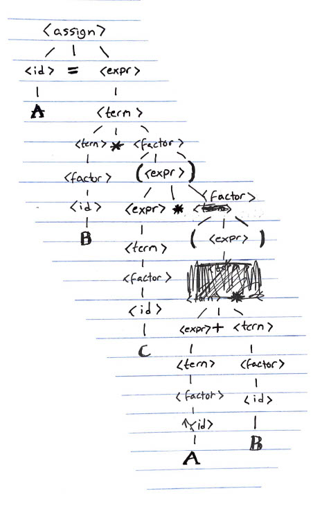

# Assignment 1 Report

Kennesaw State University<br>
College of Computing and Software Engineering<br>
Department of Computer Science<br>
CS 4308 - Concepts of Programming Languages W01

Mae Morella ([mmorella@students.kennesaw.edu](mailto:mmorella@students.kennesaw.edu))<br>
January 12, 2021

## 1. Java and C++ Programs

> Write a program in Java and an equivalent program in C++, that computes the area of a trapezoid. Describe the input and output of the program.

### Solution

The two programs outlined below.

**Input:** Take terminal input via `std::cin` in C++, and `System.in()` in Java. These inputs are parsed as double-precision floating point numbers ([IEEE 754-1985](https://en.wikipedia.org/wiki/IEEE_754-1985)). If an error is encountered in this parsing, the program exits silently.

**Output:** The program prints messages to the terminal's stdout, prompting the user for input, and outputing

#### Screenshots of Execution


#### C++ source (excerpt from `trapezoid.cpp`)

```cpp
#include <iostream>

// Calculates the area of a given trapezoid.
// @param base1 The length of the first parallel side
// @param base2 The length of the other parallel side
// @param height The perpendicular distance between these two sides
double computeTrapezoidArea(double base1, double base2, double height) {/* ... */}

// Reads and returns a double value from std::cin
// If the read fails (i.e. the input is not valid),
// @throws an integer exception 20.
double nextDouble() {/* ... */}

// Main program
int main() {/* ... */}
```

#### Java source: (excerpt from `TrapezoidAreaCalculator.java`)

```java

/**
 * Provides methods for calculating the area of a trapezoid
 * (i.e. a quadrilateral with at least two parallel sides).
 * Also includes a test program which prints the area of a user-defined triangle.
 */
import java.util.*;

public class TrapezoidAreaCalculator {
  /**
   * Calculates the area of a given trapezoid.
   * @param base1 The length of the first parallel side
   * @param base2 The length of the other parallel side
   * @param height The perpendicular distance between these two sides
   */
  public static double computeTrapezoidArea(double base1, double base2, double height) {/* ... */}
  /**
   * Main program
   * Prompts the user to input side lengths,
   * and outputs the result of the area function.
   */
  public static void main(String[] args) {/* ... */}
}
```

## 2. Investigate the general principles and goals of a system programming language. Provide two or three examples of system programming languages

* ALGOL
* Pascal
* C

## 3. Problem #3 from p. 181

> Rewrite the BNF of Example 3.4 to give `+` precedence over `*` and force `+` to be right associative.

```text
<assign> → <id> = <expr>
<id> → A | B | C
<expr> → <expr> * <term> | <term>
<term> → <factor> * <term> | <factor>
<factor> → (<expr>) | <id>
```

### 4. Problem #7d from p. 182

> ```text
> <assign> → <id> = <expr>
> <id>     → A | B | C
> <expr>   → <expr> + <term>
>          | <term>
> <term>   → <term> * <factor>
>          | <factor>
> <factor> → (<expr>)
>          | <id>
> ```
>
> Using the grammar in Example 3.4, show a parse tree and a leftmost derivation for each of the following statements:
>
> d. `A = B * (C * (A + B))`

Leftmost deriviation:

```text
<assign> → <id> = <expr>
=> A = <expr>
=> A = <term>
=> A = <term> * <factor>
=> A = <factor> * <factor>
=> A = <id> * <factor>
=> A = B * <factor>
=> A = B * (<expr>)
=> A = B * (<term>)
=> A = B * (<term> * <factor>)
=> A = B * (<factor> * <factor>)
=> A = B * (<id> * <factor>)
=> A = B * (C * <factor>)
=> A = B * (C * (<expr>))
=> A = B * (C * (<expr> + <term>))
=> A = B * (C * (<term> + <term>))
=> A = B * (C * (<factor> + <term>))
=> A = B * (C * (<id> + <term>))
=> A = B * (C * (A + <term>))
=> A = B * (C * (A + <factor>))
=> A = B * (C * (A + <id>))
=> A = B * (C * (A + B))
```


