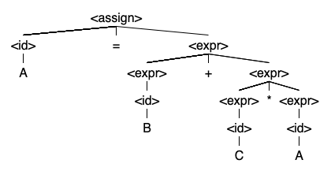
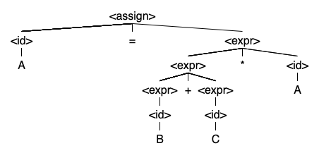

## Assignment #2

Kennesaw State University<br>
College of Computing and Software Engineering<br>
Department of Computer Science<br>
CS 4308 - Concepts of Programming Languages W01

### 1. Ambiguity of a grammar

> Explain whether the following grammar is ambiguous:
>
  ```text
  <assign> -> <id> = <expr>
  <id> -> A | B | C
  <expr> -> <expr> + <expr>
      | <expr> * <expr>
      |  (<expr>)
      | <id>
  ```

#### Solution 1

The given grammar is ambiguous, because it introduces two operators (`*` and `+`) which have equal precedence, and which can be evaluated in multiple orders. For example, the statement `A = B + C * A` has two distinct parse trees, as shown below:





If a grammar can produce multiple non-equivalent parse trees from the same statement, then it is ambiguous.

### 2. Parse trees and leftmost derivations

> Given the following grammar specification, draw the corresponding parse tree and write a leftmost derivation for each of the following statements.
>
  ``` text
  <assign> -> <id> = <expr>
  <id> -> A | B | C
  <expr> -> <id> + <expr>
      | <id> * <expr>
      |  (<expr>)
      | <id>
  ```
>
a. `A = A * (B + (C * A))`
b. `B = C * (A * C + B)`

#### Solution 2a

##### Leftmost derivation of `A = A * (B + (C * A))`

```text
<assign>
=> <id> = <expr>
=> A = <expr>
=> A = <id> * <expr>
=> A = A * <expr>
=> A = A * ( <expr> )
=> A = A * ( <id> + <expr> )
=> A = A * ( B + <expr> )
=> A = A * ( B + ( <expr> ) )
=> A = A * ( B + ( <id> * <expr> ) )
=> A = A * ( B + ( C * <expr> ) )
=> A = A * ( B + ( C * <id> ) )
=> A = A * ( B + ( C * A ) )
```

##### Parse tree of `A = A * (B + (C * A))`


#### Solution 2b

##### Leftmost derivation of `B = C * (A * C + B)`

```text
<assign>
=> <id> = <expr>
=> B = <expr>
=> B = <id> * <expr>
=> B = C * <expr>
=> B = C * ( <expr> )
=> B = C * ( <id> * <expr> )
=> B = C * ( A * <expr> )
=> B = C * ( A * <id> + <expr> )
=> B = C * ( A * C + <expr> )
=> B = C * ( A * C + <id> )
=> B = C * ( A * C + B )
```

##### Parse tree  of `B = C * (A * C + B)`


### 3. EBNF to BNF

> Convert the following grammar specification to BNF:
>
  ```text
  <S> -> <A> { b<A> }
  <A> -> a[b]<A>
  ```

#### Solution 3

```text
<S> -> <A> b<S>
     | <A>
<A> -> a<A>
     | ab<A>
```

### Problem 4: Grammar specification

> A language consists of strings that have $n$ copies of the letter "a" followed by the same number of copies of the letter "b", where $n > 0$. Define the grammar specification for the language.

#### Solution 4

```text
<S> -> a<S>b
     | ab
```

### 5. Validating sentences

> Using the following grammar:
>
  ```text
  <S> -> <A> a <B> b
  <A> -> <A> b | b
  <B> -> a <B> | a
  ```
>
> Which of the following sentences are legal in the language generated by this grammar?
>
  a.	baab
  b.	bbbab
  c.	bbaaaaaS
  d.	bbaab

#### Solution 5a ("baab")

"baab" **is a valid sentence**, as shown by the leftmost derivation:

```text
<S>
=> <A> a <B> b
=> b a <B> b
=> b a a b
```

#### Solution 5b ("bbbab")

"bbbab" **is not a valid sentence**. The below leftmost derivation shows a failed attempt to derive it.

```text
<S>
=> <A> a <B> b
=> <A> b a <B> b
=> <A> b b a <B> b
=> b b b a <B> b
!!!
=/=> b b b a b
```

Because the first rule contains `a <B>`, and `<B>` derives to at least one instance of `a`, it is not possible to have a string with only a lone instance of `a`.

#### Solution 5c ("bbaaaaaS")

"bbaaaaaS" **is not a valid sentence**. While the language defines an identifer `<S>` "S" is not a valid lexeme in this language.

#### Solution 5d ("bbaab")

"bbaab" **is a valid sentence**, as shown by the following leftmost derivation:

```text
<S>
=> <A> a <B> b
=> <A> b a <B> b
=> b b a <B> b
=> b b a a b
```
